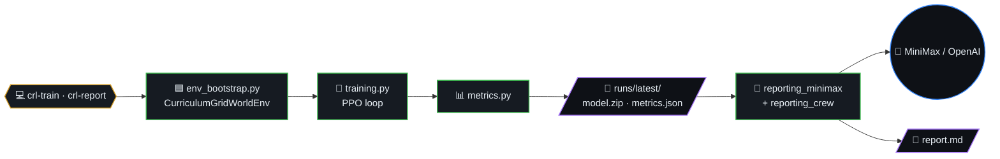
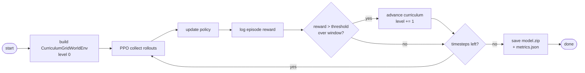
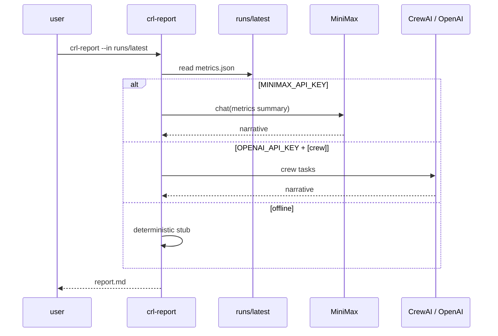
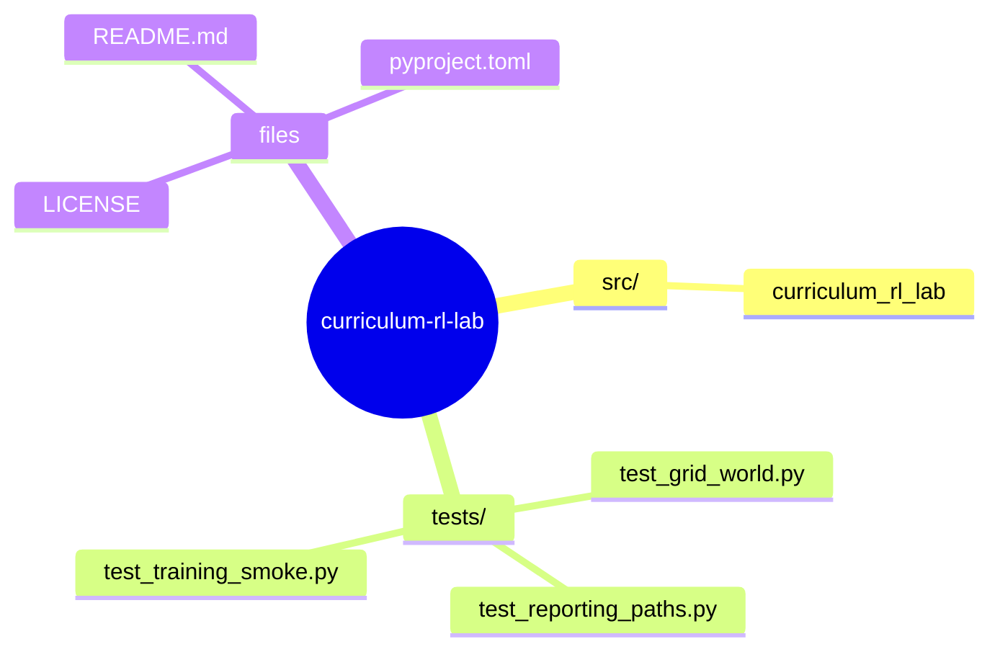

# Curriculum RL Lab

**Idea:** a *real* reinforcement-learning codebase (not a blank template): sparse-reward **grid navigation** trained with **PPO** (Stable-Baselines3 + PyTorch), plus an optional **CrewAI** “lab analyst” that turns `metrics.json` into a short narrative when `OPENAI_API_KEY` is set.



## Table of contents

- [What you get](#what-you-get)
- [PPO curriculum loop (algorithm)](#ppo-curriculum-loop-algorithm)
- [Report sequence](#report-sequence)
- [Setup](#setup)
- [Train](#train)
- [Report](#report)
- [Tests](#tests)
- [Project layout](#project-layout)
- [License](#license)
- [🗺️ Repository map](#️-repository-map)

## PPO curriculum loop (algorithm)



## Report sequence



## What you get

- Custom **Gymnasium** environment `CurriculumGridWorldEnv` (sparse goal reward, step penalty).
- **Training** script that saves `model.zip` and `metrics.json`.
- **Reporting**: rule-based markdown by default; CrewAI layer if you install extras and provide an API key.

## Setup

```bash
python3 -m venv .venv
source .venv/bin/activate
pip install -e ".[dev]"
```

### MiniMax (recommended for `crl-report`)

Copy `.env.example` to `.env` and set your MiniMax API key (OpenAI-compatible endpoint):

```bash
cp .env.example .env
# Edit .env: MINIMAX_API_KEY, optional MINIMAX_MODEL (default MiniMax-M2)
```

See [MiniMax OpenAI-compatible API](https://platform.minimax.io/docs/api-reference/text-openai-api).

Optional CrewAI report (OpenAI or other providers supported by CrewAI):

```bash
pip install -e ".[crew]"
export OPENAI_API_KEY=...
```

## Train

```bash
crl-train --out runs/latest --timesteps 80000 --seed 0
```

## Report

```bash
crl-report --metrics runs/latest/metrics.json --out runs/latest/report.md
```

## Tests

```bash
pytest
```

## Project layout

```
src/curriculum_rl_lab/
  cli.py                    # crl-train · crl-report entrypoints
  env_bootstrap.py          # CurriculumGridWorldEnv
  training.py               # PPO training loop
  metrics.py                # JSON metrics writer
  reporting_minimax.py      # MiniMax report path
  reporting_crew.py         # CrewAI report path
tests/                      # pytest suite
pyproject.toml              # [dev] + [crew] extras
```

## License

MIT


## 🗺️ Repository map

Top-level layout of `curriculum-rl-lab` rendered as a Mermaid mindmap (auto-generated from the on-disk tree).


